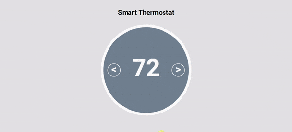

## Environment
* Last tested browser: Chrome 72
* Last tested OS: Windows 8.1

## Instructions
1. Launch `index.html` in the browser. 
2. The set point and measured temperature are set to default of 72, which is the room temperature in Fahrenheit. The thermostat is in off mode when it is first started.
3. To change the set point, click on the right button to increase temperature and click on the left button to decrease temperature.
4. To change and simulate measured temperature from external sources, go to `script.js` and modify `thermostatModel.currentTemperature`.
5. Background color of the thermostat will vary according to the rules in the pdf in the docs folder.

If you changed viewport at any point in time, please refresh to allow the thermostat to adjust to its new size

## Example

## References
Sources are acknowledged as comments in the code. Most of them are referenced from stackoverflow and W3Schools.